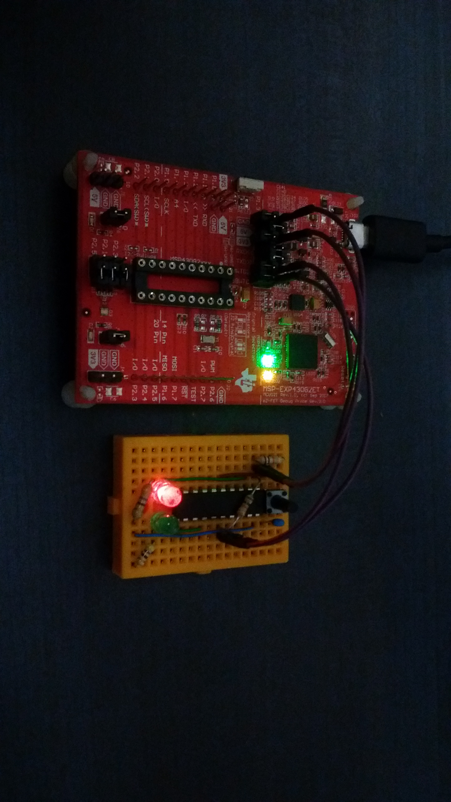

# Off_Board Blink

Blinks two leds, according to a button being pressed.

This is meant to use off of the launchpad

When the button is released, one of the LEDs will blink.
If the button is pressed, the other LED will blink at a different rate

The MSP430G2553 and MSP430F5529 are officially supported, and the source code is in the g2553 and f5529 folders, respectivly.

# Usage

To change the pin (and thus the LED), change the #define in main.c.
If you want to use an enirely different port, you will need to change the P{1,4}* references throughout the code (P1OUT, P1DIR, P4OUT, P4DIR, etc)
The same can be done for the button.

Each led has a pattern array defined for it. This array includes each of the 24 steps that the program will go through when flashing the LEDs. 24 steps was chosen because it allows there to be 12 periods, and 12 can be divisible by 3 and 4. This gives two different rates that are not multiples of each other.

The step rate is defined by the for loop in the main body of the code. To change the rate, adjust the condition in the for loop.

# Compiling and uploading

Ensure that you have msp430gcc installed. In particular, `msp430-elf-gcc` and `msp430-elf-objcopy` are used to compile the program and convert the elf to a hex for uploading.

To flash the msp430, you will need the official TI MSP Flasher installed. It will need to be avaiable as `mspflash`. This allows a wrapper script to set the `LD_LIBRARY_PATH` correctly for MSP Flasher.

Simply type `make` in the correct directory for your processor, and the program will be compiled and uploaded to an attached Launchpad.

